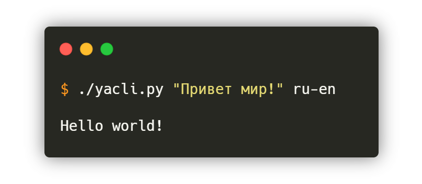

# Yandex Translate
Yandex translate application for Desktop  

## Build binary file

With [pyinstaller](https://www.pyinstaller.org/) installed, run

    $ pyinstaller -F -w index.py -i "favicon.ico" --hidden-import=clr

Default resolution - `1280x720`  

## CLI

    $ ./yacli.py [text] [transl.langs]

**transl.langs** - ru-en is arg. by default

### For example 

